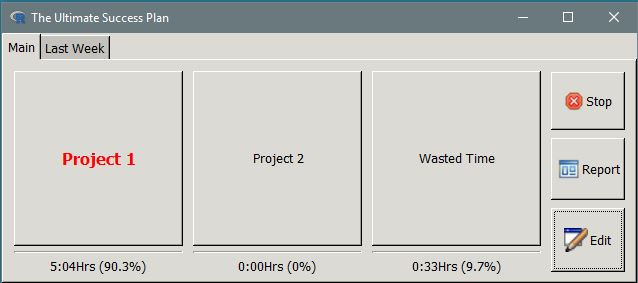
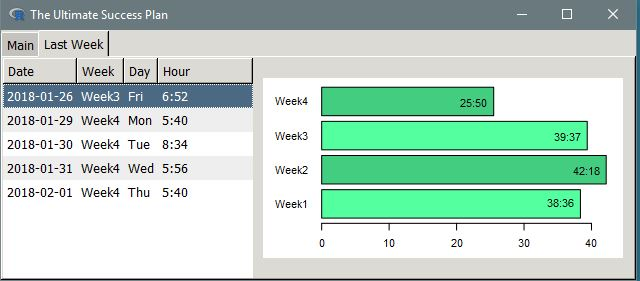

# successr
Tracking work and wasted time for ultimate success.

_successr_ is an R tool for tracking the amount of time you work (and waste) during the
day. At a metaphysical level, time can be divided into two categories: work time and
wasted time. Work time is effectively used when you focus on at most two relevant projects
during the day.  _Wasted Time_ includes anything that does not fall in _Project 1_ and/or
_Project 2_.  Culprits for _Wasted Time_ are typically toilet/cigarette/watercooler
excursions, lunch breaks, unannounced visits by the boss, any meeting, internet surfing,
chit chat with colleagues, or courtesy calls by telemarketers, friends/family, and
partner(s). Effective time use is surely the first step to ultimate
success.[1](https://www.amazon.com/Getting-Things-Done-ABCs-Management/dp/B004JFYWO2)

Clicking _Project 1_, _Project 2_, and _Wasted Time_ starts the timer,
and _Stop_ stops the timer. _Report_ gives a daily, weekly, monthly breakdown
of work time. _Edit_ allows you to edit only the time recorded during the day and
the Task (from a drop-down menu). DayData.csv allows you to edit the total time
for a given day (see below). 

Upon installation, successr will setup a data folder (where the data is stored) with a
configuration file, called config.yml. The folder can be found in `Sys.getenv("HOME")`. If
you want to specify an alternative folder path, then you must put in your .Rprofile the
following line: `Sys.setenv(R_SUCCESS = "my/folder/path")`. In my Rprofile set-up, I have
`Sys.setenv(R_SUCCESS = "~/Dropbox/successr")` so I can sync between my work and
home computers. Labels for _Project 1_, _Project 2_, _Wasted Time_ and the _Window Title_
can be changed in the config.yml file. But don't waste time doing this, just use the
default settings.  

_devtools_ is recommended for install. 

<code>
library(devtools);
install_github("vando026/successr")

</code>

